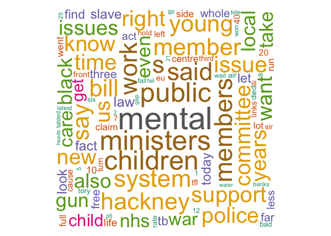

twfyR
================
Jack Blumenau

About the package
-----------------

This package provides an R binding for the [TheyWorkForYou API](http://www.theyWorkForYou.com/api). This package is still in the very early stages of development. Use with caution.

How to install
--------------

The package is currently only available on github.

``` eval
library(devtools)
install_github("jblumenau/twfyR")
library(twfyR)
```

Set your API key
----------------

Use of the API is dependent on obtaining an API key from TheyWorkForYou. This is easily done [here](https://www.theyworkforyou.com/api/key).

Before trying to get any data using the R functions in this package, you will need to use the `set_twfy_key()` function.

``` r
my_key <- "api_key_from_twfy"
set_twfy_key(my_key)
```

Calling the API
---------------

Calls to the twfy API are made via a series of `get` functions, such as `getMPs()` and `getDebates()`. Each of these functions takes a number of arguments to refine the results that are returned by the API. In each case, the function attempts to convert the XML data returned by the call into an R data object (normally a `data.frame` but sometimes a `list` (and sometimes even a `list` of `data.frames`)).

Let's try getting the current MPs serving in parliament. This is the default output of the `getMPs()` function:

``` r
current_mps <- getMPs()

str(current_mps)
## List of 2
##  $ members:'data.frame': 650 obs. of  5 variables:
##   ..$ member_id   : Factor w/ 650 levels "40706","40707",..: 1 2 3 4 5 6 7 8 9 10 ...
##   ..$ person_id   : Factor w/ 650 levels "10001","10008",..: 279 280 210 388 233 15 342 285 35 157 ...
##   ..$ name        : Factor w/ 650 levels "Adam Afriyie",..: 81 342 576 344 345 464 100 286 289 264 ...
##   ..$ party       : Factor w/ 14 levels "Conservative",..: 5 5 5 1 1 5 5 1 2 5 ...
##   ..$ constituency: Factor w/ 650 levels "Aberavon","Aberconwy",..: 290 559 603 413 457 387 386 31 317 642 ...
##  $ office :'data.frame': 1070 obs. of  9 variables:
##   ..$ member_id   : Factor w/ 650 levels "40706","40707",..: 1 1 2 3 4 5 5 6 6 6 ...
##   ..$ person_id   : Factor w/ 650 levels "10001","10008",..: 279 279 280 210 388 233 233 15 15 15 ...
##   ..$ name        : Factor w/ 650 levels "Adam Afriyie",..: 81 81 342 576 344 345 345 464 464 464 ...
##   ..$ party       : Factor w/ 14 levels "Conservative",..: 5 5 5 5 1 1 1 5 5 5 ...
##   ..$ constituency: Factor w/ 650 levels "Aberavon","Aberconwy",..: 290 290 559 603 413 457 457 387 387 387 ...
##   ..$ position    : Factor w/ 263 levels "Member","Shadow Minister (Public Health)",..: 1 1 1 2 NA 3 4 1 1 1 ...
##   ..$ department  : Factor w/ 57 levels "Public Accounts Committee",..: 2 1 3 4 NA 4 4 5 7 6 ...
##   ..$ from_date   : Date[1:1070], format: "2010-10-11" ...
##   ..$ to_date     : Date[1:1070], format: "2017-01-05" ...
```

The output is a list of 2 `data.frames`. The first is a data.frame with unique rows for each current MP. The second is a data.frame of each parliamentary position that each current member holds.

Let's try retreiving the speeches of one member of parliament. We'll use the `getDebates()` function, and use `type = "commons"` to specify that we wish to see speeches made in the House of Commons, and `person = 10001` to choose our MP of interest (here it is [Dianne Abbott](https://www.theyworkforyou.com/mp/10001/diane_abbott/hackney_north_and_stoke_newington)).

``` r
speeches <- getDebates(person = 10001, type = "commons")

class(speeches)
## [1] "data.frame"

dim(speeches)
## [1] 1000   27
```

The default behaviour of the `getDebates()` function is to return 1000 results. But if we wish to receive *all* the speeches ever made by a given person, we can set `complete_call = TRUE`. Note, however, that this specification will submit several requests to the twfy API, and is a quick way to use up your call allowance if done too often.

Finally, let's do something with these speeches using the excellent [quanteda](https://github.com/kbenoit/quanteda) library.

``` r
library(quanteda)

speech_corpus <- corpus(speeches$body)

speech_dfm <- dfm(speech_corpus, remove = c("will", stopwords("english")),
             removePunct = TRUE)

speech_dfm <- dfm_trim(speech_dfm, max_count = 400, min_count = 10)

speech_idf <- tfidf(speech_dfm)

textplot_wordcloud(speech_idf, min.req = 10, random.order = FALSE, rot.per = .25, 
                   colors = RColorBrewer::brewer.pal(8,"Dark2"))
```


